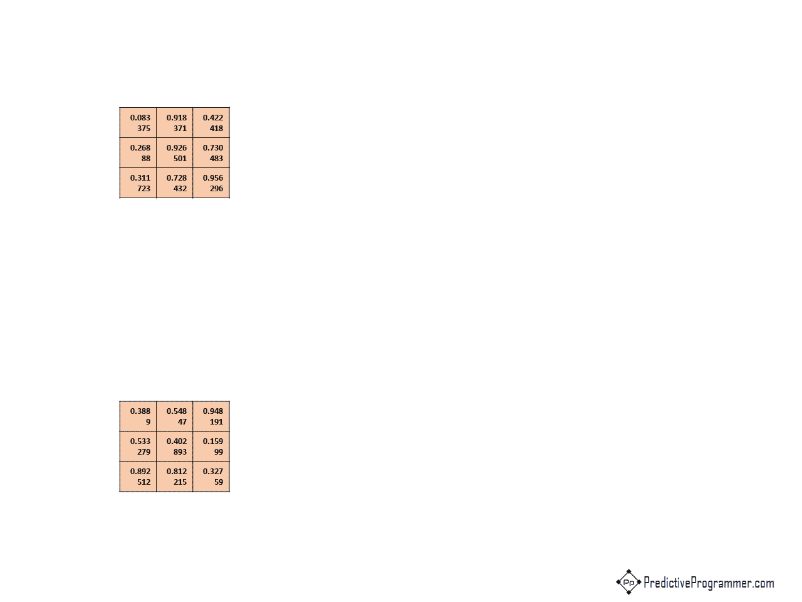

# Convolutions and Variants
This repository is in conjunction with the post "[Convolution and Variants - Predictive Programmer](https://predictiveprogrammer.com/convolution-and-variants/)". The post discuss the working of following convolution variants.

## Excel Files
1. [Simple Convolutions](excels/basicCNNs.xlsx)
2. [1x1 Conv](excels/1x1convs.xlsx)
3. [Depthwise Separable Conv](excels/depthwise_separable_convs.xlsx)
4. [Transposed Convolution](excels/transposed_convs.xlsx)

## Simple Convolution
A step by step guide to how a simple convolution works visit [here](https://predictiveprogrammer.com/convolution-and-variants#simple-cnn)

## 1x1 Convolutions
Want to learn how and why 1x1 convs used? Visit [here](https://predictiveprogrammer.com/convolution-and-variants#1x1conv)

## Depth-wise Separable Convolutions
Want to know what works behind a MobileNet? Visit [here](https://predictiveprogrammer.com/convolution-and-variants#separable-conv)

## Transposed Convolution
How to perform an operation to upsample an input volume? Learn [here](https://predictiveprogrammer.com/convolution-and-variants#transposed-conv)

